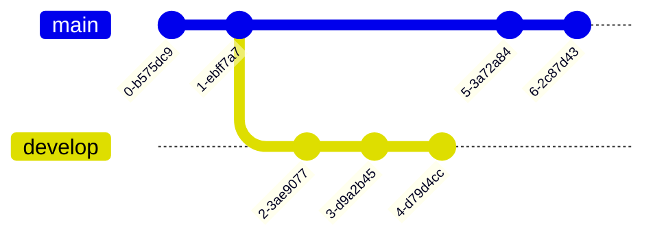

# $\_ Gilberto Luis Koerbes Junior

```bash
#!/bin/bash
echo 'Welcome!'
```

### About me 💭:

<p>
Se você chegou até aqui, vou me apresentar de uma forma mais descontraída ;).
<p>
Sou Gilberto, tenho 24 anos, _Bachelor of Computer Science_ (Pontícicia Univerdade Católica do Rio Grande do Sul - PUCRS, 2024). Com alguns anos mergulhado na tecnologia, meu maior início foi no ensino médio/técnico, onde comecei programação Pascal (e muito ';' ), passando por HTML, CSS e Java, UML e SQL.
<p> Sempre buscando soluções e alinhado com a industria, atuo ativamente (_¡expert!_) com Cloud (especialmente AWS), Terraform, Zabbix, Containers, Linux (indispensável), Python(para muitos fins - de Script a MachineLearning) e sou um entusiasta em tecnologias emergentes. Trabalhei com Infraestrutura Onpremisse com servidores Lenovo e IBM e vasta infraestrutura de redes.
<p>
Busco continuamente conhecimentos de Engenharia de Software, Escalabilidade e Arquitetura. 
<p>

```
 ____              ___
|  _ \  _____   __/ _ \ _ __  ___             _<_    __>_
| | | |/ _ \ \ / / | | | '_ \/ __|           / _ \ / / _ \
| |_| |  __/\ V /| |_| | |_) \__ \          v (_) /^/ (_) v
|____/ \___| \_/  \___/| .__/|___/           \_>_/_/ \_<_/
                       |_|

```


