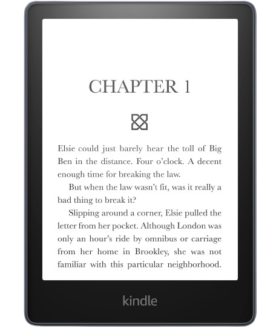

<font color="#E6FF94"> <h1> $\_ Gilberto Luis Koerbes Junior </h1> </font>

```bash
#!/bin/bash
echo 'Welcome!'
```

💻 **Sugiro que abra esta página em navegador de computador para carregar alguns componentes.**

<font color="#FF311F"> 
<h2>
.

└── whoami

 </h2> </font>

**_(Sobre mim 💭:)_**

Se você chegou até aqui, vou me apresentar de uma forma mais descontraída ;). Este repositório, é além de uma apresentação, uma reflexão (para mim) e um registro de muitas coisas.

<br>

Sou Gilberto, tenho 24 anos (2000), _Bachelor of Computer Science_ (Pontifícia Universidade Católica do Rio Grande do Sul - PUCRS, 2024). Com alguns anos mergulhado na tecnologia, meu início 'formal' foi no ensino médio/técnico (Inst. Federal, 2015), onde comecei programação Pascal (e muito _begin_, _end_ e ponto-e-vírgula';'), passando por HTML, CSS e Java, UML e SQL. Mas, ainda antes disso, meu interesse maior já era por computadores, pois gostava de entender como funcionava e como podia melhora-lo (eu consegui um OverClock em um Processador Intel® Pentium® E5500, dual-core indo de de 2.5GHz para 3.45GHz --- nessa época a internet ainda era muito mato para mim, ~2010). Mas ainda sobre a faculdade, eu acredito que realmente foi um 360º no meu RoadMap de carreira, quando desisti de uma bolsa de Direito (questionado por muitos) e decidi que seguiria nesta área da Tecnologia. Ainda tenho muito a trilhar, mas sinto que foi assertivo.

<br>
<br>

```
                             ____              ___
                            |  _ \  _____   __/ _ \ _ __  ___             _<_    __>_
                            | | | |/ _ \ \ / / | | | '_ \/ __|           / _ \ / / _ \
                            | |_| |  __/\ V /| |_| | |_) \__ \          v (_) /^/ (_) v
                            |____/ \___| \_/  \___/| .__/|___/           \_>_/_/ \_<_/
                                                   |_|

```

Profissionalmente atuo ativamente ( _¡expert!_ ) com Cloud (especialmente AWS), Terraform (construção de módulos e padronização), Zabbix (bastante descobertas com LLD e otimização), Containers (Linux e Windows), Linux (indispensável), Python(para muitos fins - de Script, processamento de dados e até MachineLearning na faculdade).
Mantenho e domino uma parte destas tecnologias em repositórios do Git e aplicamos alguns fluxos com as pipelines do Gitlab, rodando runners sobre Containers. Considero que tenho um bom domínio sobre Git, indo além do clássico add, commit e push, consigo trabalhar e auxiliar colegas para trabalho colaborativo e resolvendo os conflitos de código quando existem.

No dia-a-dia, organizo minhas atividades com minha equipe no Jira e, contra algumas crenças, eu acredito que o 'Agile' e 'Scrumbam' funcionam para minha produtividade.

Por último, minha primeira experiência foi um pouco distante do que estou hoje, mas contribuiu significativamente para criar uma sólida base e desbravar sozinho pequenos diários. Trabalhei em uma pequena prefeitura como servidor público no 'Setor de T.I'. Atuei com Infraestrutura Onpremisse com servidores Lenovo, IBM e HPE, onde trabalhei com Hypervisor VMWare Esxi, tive oportunidade de montar e subir um servidor em um rack e configurar o RAID dos discos dos servidores. Trabalhei com CFTV/IP e vasta infraestrutura de redes (PfSense, Mikrotik, Unifi e redes de fibra óptica).

```

```

[comment]: <> (## Tempo livre e estudos 📚)

<font color="#D6EFD8">
<h2> Tempo livre e estudos 📚 </h2>
</font>
Busco continuamente conhecimentos de Engenharia de Software, Escalabilidade e Arquitetura. Pretendo iniciar alguma pós-graduação focada nisto e futuramente pretendo fazer mestrado mesmo não tendo foco em academia, acredito que o aprendizado constante é o que nos move.
Estou no momento estudando algumas tecnologias por hobby, como NestJS e React.

No meu tempo livre, eu gosto de coisas do tipo DIY (faça você mesmo), gosto de assistir documentários, aviação e carros.

Eu também busco ler no meu Kindle alguns livros, técnicos e não-técnicos:

 

---

<font color="#448cac">
<h3> Um pouco sobre Ciência da Computação 🎓 </h3>
</font>

Na Bolha Tech sempre ouvi discussão de fazer ou não faculdade. Eu nunca entrei nesta discussão até concluir a minha. De certo ponto, tive a honra, enquanto bolsista integral, de prestigiar de uma das [melhores universidades privadas](https://www.pucrs.br/soupucrs-tecnico/melhor-universidade-privada/) com o curso de Ciência da Computação [\[Capes 7 (Máx)\]](https://portal.pucrs.br/pesquisa/programas-de-pos/ciencia-da-computacao/) entre os melhores do Brasil. Não somente por isso, mas desta trajetória eu realmente sinto que foi um divisor em minha vida e carreira de maneira positiva.

Acredito que durante a graduação as vezes temos dificuldade em enxergar o valor sobre cada aprendizado, mas percebo que a forma como enfrentamos os problemas são um diferencial. Tive oportunidade de estar no "novo currículo 98AJ", que além dos conceitos fundamentais de computação (algoritmos, estruturas de dados, formalizações, teoremas, baixo nível e mais) tivemos disciplinas mais práticas em Engenharia de Software, Laboratórios e atualidades, como IA e MachineLearning (não por hype, mas fundamentos e aplicações das mesmas). Acredito que o maior diferencial com este curso é a abordagem de base em diversas áreas.

Não fui o 'Aluno CDF Top 1', mas acredito que dentro da minha realidade (trabalho, casa, família, contas...) tive bom proveito nas disciplinas, com alto grau nas disciplinas e nenhuma recuperação --- resultado de interesse, comprometimento e esforço --- obtive um rendimento médio acima de 8,5.

Montei este diagrama abaixo em **_Mermaid_** como mais um dos meus "passatempos" com as disciplinas que vi e dos resultados. Não necessariamente está na ordem e correlação entre as disciplinas (mas próximo --- [98AJ](https://portal.pucrs.br/wp-content/uploads/2024/04/2024_04_04-ciencia_da_computacao_grade_98AJ.pdf)). Em [meu GitHub](https://github.com/gilbertokoerbes?tab=repositories) tenho alguns dos projetos de cada disciplina, não organizados como gostaria, mas um registro do que foi feito.

Com isso, durante a criação deste criação, me fez lembrar de cada disciplina, de cada conteúdo, de cada trabalho e de cada professor.

[comment]: <> (a reference mermaid link.)
